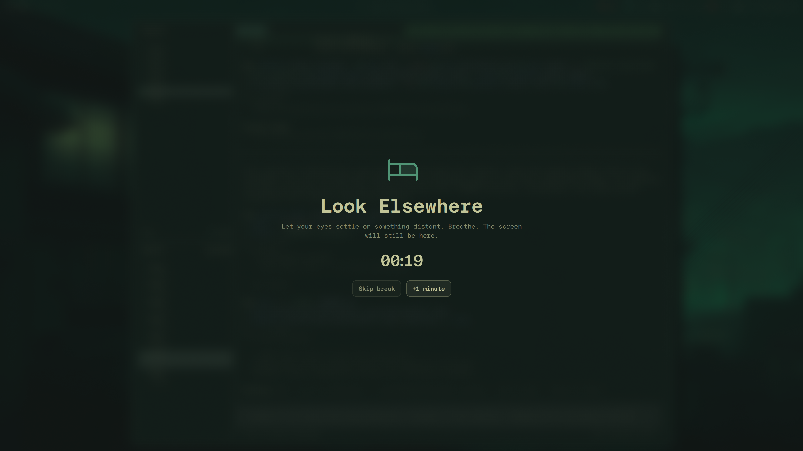

# Look Elsewhere

Look Elsewhere is a private, context-aware break coach built natively for Omarchy. It counts active screen use, waits through protected moments such as meetings, media, fullscreen work, and dictation, then delivers a calm warning and break at a better moment.



The repository contains a resident scheduling service, bar widget, anchored quick panel, progressive warning, final countdown, and theme-aware multi-monitor break overlay. Release verification is tracked in the [completion matrix](docs/completion-matrix.md).

## Product promise

> Look Elsewhere finds the right moment to pull your attention away from the screen.

The competition MVP is a self-contained Omarchy Shell plugin written with Quickshell/QML. It observes only coarse local state. It does not record audio, capture the screen, retain window or media titles, require an account, or send telemetry.

## Current capabilities

- Active-use scheduling with timestamp persistence and recovery
- Idle, Hyprland fullscreen, MPRIS playback, PipeWire microphone, and Omarchy dictation evidence
- Confidence-based protected-context delay and cooldown
- Wayland-native natural-pause timing before a due warning
- Gentle, Balanced, and Focused enforcement policies
- Omarchy-native bar, popup, warning, countdown, and break surfaces
- Manifest-backed configuration for timing, office hours, detectors, enforcement, snoozing, and reduced motion
- One interactive authority across multiple outputs
- Deterministic IPC demo states that do not persist synthetic data
- Theme-role integration for contrasting Omarchy themes

## Development preview

With the plugin installed and enabled:

```bash
omarchy-shell look-elsewhere demo protected
omarchy-shell look-elsewhere demo idle
omarchy-shell look-elsewhere demo flow
omarchy-shell look-elsewhere demo warning
omarchy-shell look-elsewhere demo final
omarchy-shell look-elsewhere demo break
omarchy-shell look-elsewhere demo gentle-break
omarchy-shell look-elsewhere demo focused-break
omarchy-shell look-elsewhere demo recovery
omarchy-shell look-elsewhere demoOff
```

These fixtures are development tools. They restore the pre-demo snapshot and never write synthetic state.

## Configuration

The competition MVP follows Omarchy's config-first plugin convention. Settings live in the plugin's bar-widget entry in `~/.config/omarchy/shell.json`; use the supported CLI to update them without editing JSON by hand:

```bash
omarchy bar set io.github.silouanwright.look-elsewhere focusMinutes 25 --json
omarchy bar set io.github.silouanwright.look-elsewhere breakSeconds 45 --json
omarchy bar set io.github.silouanwright.look-elsewhere enforcement '"balanced"' --json
omarchy bar set io.github.silouanwright.look-elsewhere officeHoursEnabled true --json
omarchy bar set io.github.silouanwright.look-elsewhere reducedMotion false --json
omarchy bar set io.github.silouanwright.look-elsewhere soundEnabled true --json
omarchy bar set io.github.silouanwright.look-elsewhere outputMode '"all"' --json
omarchy bar set io.github.silouanwright.look-elsewhere displayMode '"icon-and-time"' --json
```

`displayMode` accepts `icon`, `time`, or `icon-and-time`. The compact countdown shows minutes, then switches to seconds during the final minute. Vertical bars use the icon so the widget remains legible.

The complete typed contract, defaults, ranges, and descriptions are declared in [`manifest.json`](manifest.json). A dedicated graphical settings client is intentionally deferred until after the competition MVP.

Inspect or reset private local state with:

```bash
omarchy-shell look-elsewhere diagnostics
omarchy-shell look-elsewhere resetLocalData
```

`resetLocalData` removes the local schedule and aggregate outcome history on the next atomic state write. It does not change Omarchy configuration.

Enforcement behavior is explicit: Gentle permits snoozing and ordinary skipping, Balanced keeps snoozing bounded, and Focused hides ordinary exits. Focused mode always retains `Ctrl+Shift+Esc` as a documented emergency exit.

## Install

```bash
omarchy plugin add https://github.com/silouanwright/look-elsewhere.git --enable
```

Disable or remove it safely with:

```bash
omarchy plugin disable io.github.silouanwright.look-elsewhere
omarchy plugin remove io.github.silouanwright.look-elsewhere
```

Look Elsewhere requires Omarchy Quattro with Omarchy Shell. It has no installer
hook, privileged operation, external daemon, account, or network dependency.
Its optional break sound uses `canberra-gtk-play` when available; the scheduler
and all visual behavior continue normally without it.

## Project identity

- Author: Silouan Wright
- Plugin ID: `io.github.silouanwright.look-elsewhere`
- License: MIT
- Runtime target: Omarchy Quattro / Omarchy Shell
- Source repository: `silouanwright/look-elsewhere`

## Documentation

Product behavior, architecture, privacy boundaries, research, ADRs, verification, and competition delivery live under [`docs/`](docs/README.md).
