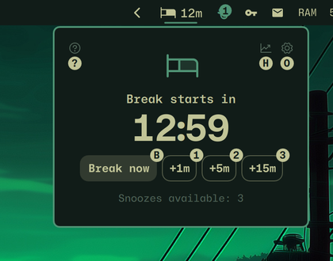
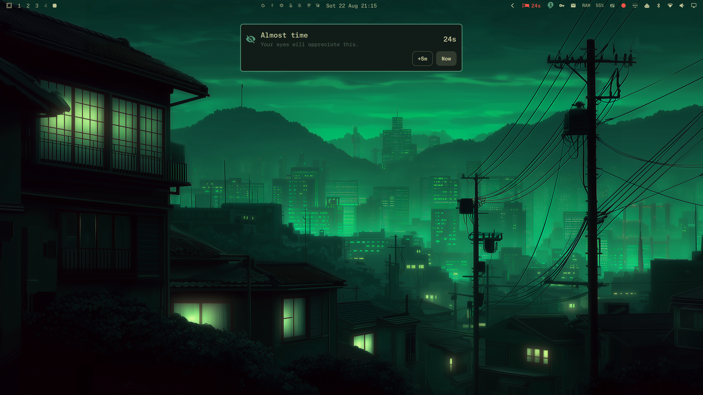

# Look Elsewhere

Look Elsewhere is a privacy-conscious, context-aware break coach built natively for Omarchy. It counts active screen use, waits through protected moments such as meetings, media, fullscreen work, and dictation, then delivers a calm warning and break at a better moment.


The repository contains a resident scheduling service, bar widget, anchored quick panel, progressive warning, final countdown, and theme-aware multi-monitor break overlay. Release verification is tracked in the [completion matrix](docs/completion-matrix.md).

## Product promise

> Look Elsewhere finds the right moment to pull your attention away from the screen.

The competition MVP is a self-contained Omarchy Shell plugin written with Quickshell/QML. It observes only coarse local state. It does not record audio, capture the screen, retain window or media titles, require an account, or send telemetry.

## From glance to break

The bar countdown opens a compact, anchored control surface. When focused use
reaches its final seconds, Look Elsewhere progresses from a top-centered warning
to a small final countdown and then a calm, theme-aware break surface.

| Anchored quick panel | Progressive warning |
|---|---|
|  |  |

[Watch the 21-second deterministic warning-to-break demo](docs/assets/demo.mp4).
The capture uses synthetic fixture state, does not inspect private context, and
returns the real schedule unchanged when it ends.

## Current capabilities

- Active-use scheduling with timestamp persistence and recovery
- Idle, Hyprland fullscreen, MPRIS playback, PipeWire microphone, and Omarchy dictation evidence
- Confidence-based protected-context delay and cooldown
- Wayland-native natural-pause timing before a due warning
- Gentle, Balanced, and Focused enforcement policies
- Omarchy-native bar, popup, warning, countdown, and break surfaces
- Manifest-backed configuration for timing, office hours, detectors, enforcement, snoozing, and reduced motion
- One interactive authority across multiple outputs
- Deterministic IPC demo states that do not persist synthetic data
- Theme-role integration for contrasting Omarchy themes

## Development preview

With the plugin installed and enabled:

```bash
omarchy-shell look-elsewhere demo protected
omarchy-shell look-elsewhere demo idle
omarchy-shell look-elsewhere demo flow
omarchy-shell look-elsewhere demo warning
omarchy-shell look-elsewhere demo final
omarchy-shell look-elsewhere demo break
omarchy-shell look-elsewhere demo gentle-break
omarchy-shell look-elsewhere demo focused-break
omarchy-shell look-elsewhere demo recovery
omarchy-shell look-elsewhere demoOff
```

These fixtures are development tools. They restore the pre-demo snapshot and never write synthetic state.

## Configuration

The competition MVP follows Omarchy's config-first plugin convention. Settings live in the plugin's bar-widget entry in `~/.config/omarchy/shell.json`; use the supported CLI to update them without editing JSON by hand:

```bash
omarchy bar set io.github.silouanwright.look-elsewhere focusMinutes 25 --json
omarchy bar set io.github.silouanwright.look-elsewhere breakSeconds 45 --json
omarchy bar set io.github.silouanwright.look-elsewhere enforcement '"balanced"' --json
omarchy bar set io.github.silouanwright.look-elsewhere officeHoursEnabled true --json
omarchy bar set io.github.silouanwright.look-elsewhere reducedMotion false --json
omarchy bar set io.github.silouanwright.look-elsewhere soundEnabled true --json
omarchy bar set io.github.silouanwright.look-elsewhere outputMode '"all"' --json
omarchy bar set io.github.silouanwright.look-elsewhere displayMode '"icon-and-time"' --json
```

`displayMode` accepts `icon`, `time`, or `icon-and-time`. The compact countdown shows minutes, then switches to seconds during the final minute. Vertical bars use the icon so the widget remains legible.

When `soundEnabled` is true, Look Elsewhere plays a quiet freedesktop theme cue
when a break begins and a distinct completion cue when it is time to return.
Demo fixtures and state restoration never replay either cue.

The complete typed contract, defaults, ranges, and descriptions are declared in [`manifest.json`](manifest.json). A dedicated graphical settings client is intentionally deferred until after the competition MVP.

Inspect or reset private local state with:

```bash
omarchy-shell look-elsewhere diagnostics
omarchy-shell look-elsewhere resetLocalData
```

`resetLocalData` removes the local schedule and aggregate outcome history on the next atomic state write. It does not change Omarchy configuration.

Enforcement behavior is explicit: Gentle permits snoozing and ordinary skipping, Balanced keeps snoozing bounded, and Focused cannot be skipped. In Focused mode the full-screen break ends only when its timer completes.

## Keyboard control

The anchored panel takes keyboard focus when opened. Tab and Shift+Tab move
through every control, Enter or Space activates the focused control, and Escape
closes the panel. Direct panel keys keep common actions immediate:

| Key | Action |
|---|---|
| `b` | Start a break now |
| `1` / `2` / `3` | Snooze for 1 / 5 / 15 minutes when policy allows |
| `p` | Pause or resume scheduled breaks |
| `h` | Toggle break history |
| `o` | Toggle options |
| `q` or `Esc` | Close the panel |

Look Elsewhere does not silently claim global keys. On a stock Omarchy install,
these optional bindings can be added to `~/.config/hypr/bindings.lua`:

```lua
o.bind("SUPER + ALT + L", "Look Elsewhere", "omarchy-shell look-elsewhere-panel toggle")
o.bind("SUPER + ALT + B", "Take an eye break", "omarchy-shell look-elsewhere takeBreak")
o.bind("SUPER + ALT + P", "Pause or resume eye breaks", "omarchy-shell look-elsewhere togglePause")
```

Check `omarchy menu keybindings --print` before adopting the recipe if you have
custom bindings. IPC remains available for different key choices and scripts.

## Install

```bash
omarchy plugin add https://github.com/silouanwright/look-elsewhere.git --enable
```

Disable or remove it safely with:

```bash
omarchy plugin disable io.github.silouanwright.look-elsewhere
omarchy plugin remove io.github.silouanwright.look-elsewhere
```

Look Elsewhere requires Omarchy Quattro with Omarchy Shell. It has no installer
hook, privileged operation, external daemon, account, or network dependency.
Its optional break sound uses `canberra-gtk-play` when available; the scheduler
and all visual behavior continue normally without it.

## Project identity

- Author: Silouan Wright
- Plugin ID: `io.github.silouanwright.look-elsewhere`
- License: MIT
- Runtime target: Omarchy Quattro / Omarchy Shell
- Source repository: `silouanwright/look-elsewhere`

## A note from Silouan

I voluntarily stepped away from full-time work about a year ago. After twenty
years as an engineer, I know what I want to return for: work I genuinely love,
with the freedom to use agentic coding as deeply as the work deserves.

Look Elsewhere is a demonstration of how I work. I care about the last
few pixels, but also the state model beneath them; I research unfamiliar
territory until I understand the real constraints, turn that research into
clear product decisions, and communicate what is wrong precisely enough to fix
it. I move comfortably between product strategy, interaction design, systems
engineering, debugging, documentation, and release discipline. Omarchy feels
like the kind of product and community I would love to help build full time.

I built this project in close collaboration with an AI coding agent, from the
first research question through product decisions, ADRs, implementation, live
visual iteration, debugging, and release verification. That process is part of
the work sample. I can direct agents across a long, complex effort without
outsourcing judgment: recognize when something merely passes versus actually
feels right, explain why, separate a stale deployment from a flawed design, and
keep product quality, technical truth, and scope aligned. The long development
record also shows persistence without aimlessness: test an assumption, inspect
the evidence, revise the implementation or the direction, and preserve what was
learned so the next iteration starts further ahead.

I am entering because I want to contribute, not for the prize. If Look Elsewhere
wins, I will donate the prize money to charity. More than anything, I would love
the opportunity to get back to work with people building something this alive.

## Documentation

Product behavior, architecture, privacy boundaries, research, ADRs, verification, and competition delivery live under [`docs/`](docs/README.md).
