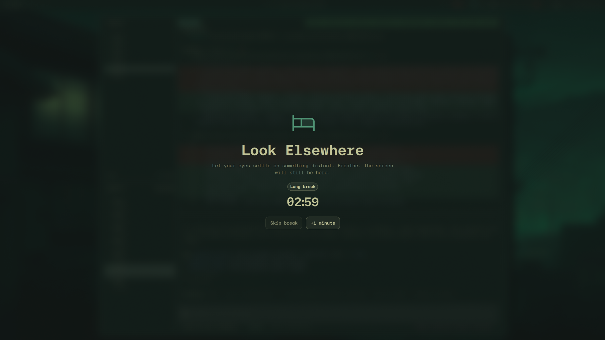
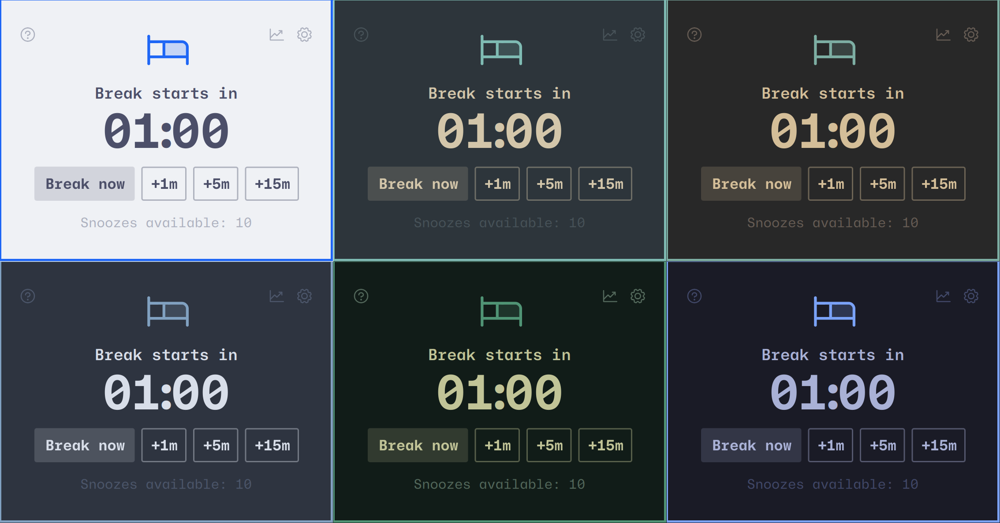
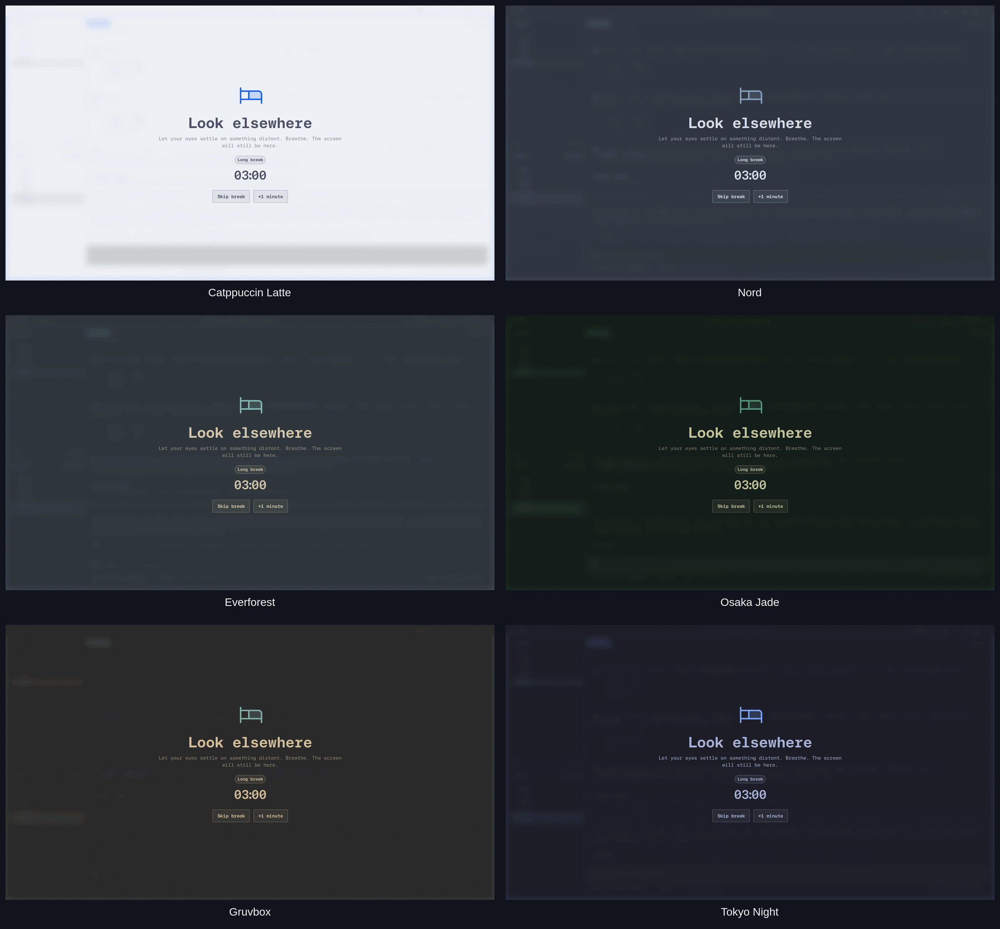
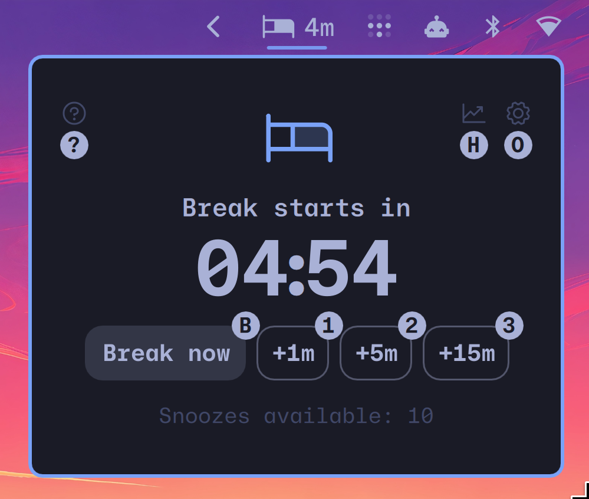

# LookElsewhere

Reduce eye strain without breaking your flow.

## Why LookElsewhere?

Let's face it: many of us look at screens for most of the day, whether for
work, entertainment, or staying close to the people we love. Extended screen
use can contribute to digital eye strain, dry eyes, headaches, and fatigue.

The [American Optometric Association](https://www.aoa.org/healthy-eyes/eye-and-vision-conditions/computer-vision-syndrome)
recommends the 20-20-20 rule: every 20 minutes, look at something 20 feet away
for 20 seconds. It is a simple habit, but how do you remember it? What if you
are in a meeting, watching a video, using dictation, or finishing something
important? What if you need another minute without abandoning the habit?

Enter LookElsewhere.

LookElsewhere counts active screen use and waits for a less disruptive moment
to begin a break. It stays flexible enough for real work while helping you stay
accountable to step away.

## Inspiration

Thank you to [Kushagra Agarwal](https://lookaway.com/press-kit/), the developer
of LookAway. LookElsewhere is undeniably inspired by his thoughtful Mac app,
rebuilt with Omarchy and Linux flair.

## Features

- First-class Omarchy integration with automatic support for installed themes
- A self-contained Quickshell/QML plugin, not an Electron app
- Lightweight, responsive, and built for Hyprland and Wayland
- Complete keyboard-first navigation, with full pointer support too
- Active-use scheduling that waits through typing, dictation, focused video,
  meetings, fullscreen apps, protected apps, and away time
- Progressive warnings, short breaks, periodic long breaks, snoozing, office
  hours, enforcement modes, and configurable sounds
- Private by design: no account, telemetry, screen capture, audio recording, or
  retained window and media titles
- Free and open source

## Install

```bash
omarchy plugin add https://github.com/silouanwright/lookelsewhere.git --enable
```

LookElsewhere requires Omarchy Quattro with Omarchy Shell. It has no installer
hook, privileged operation, external daemon, account, or network dependency.

Pause reminders from the Options page. To disable or later restore the entire
plugin, use Omarchy's plugin manager or:

```bash
omarchy plugin disable io.github.silouanwright.look-elsewhere
omarchy plugin enable io.github.silouanwright.look-elsewhere right
```

To remove it:

```bash
omarchy plugin remove io.github.silouanwright.look-elsewhere
```

## The menubar

LookElsewhere starts in the bar. At a glance, you can see how much active time
remains until your next break. When scheduling is paused or protected, the bar
shows why instead of leaving you to wonder whether the timer stopped.

## The plugin panel


## A gentle warning


## Full-screen breaks



When it is time, LookElsewhere becomes a calm, theme-aware full-screen
intermission. Short breaks can last only a few seconds. After a configurable
number of short breaks, a longer break gives you time to walk, stretch, and
properly leave the screen.

The title, guidance, duration, long-break cadence, sounds, output behavior,
snoozing, and enforcement policy are all configurable.

[Watch the 23-second warning-to-break demo](docs/assets/demo.mp4). It uses
synthetic state and restores the real schedule when it finishes.

## Themes

LookElsewhere inherits your Omarchy theme and looks beautiful on all of them.

### Panel



### Fullscreen



## Keyboard first



Press `?` to reveal a command layer inspired by
[Godspeed](https://godspeedapp.com/). Every label is a live, configurable
shortcut.

- Jump directly to breaks, snoozes, history, options, or a settings category.
- Navigate the entire interface with arrow keys, Tab, and Shift+Tab.
- Use Enter or Space to activate controls and Escape to back out or close.
- Skip unavailable actions and keep focused settings visible while scrolling.

Shortcuts are window-local and can be changed in
[Configuration](CONFIGURATION.md).

For global invocation, add the recommended `Super+Alt+L` Omarchy binding:

```lua
o.bind("SUPER + ALT + L", "LookElsewhere", "omarchy-shell look-elsewhere-panel toggle")
```

## Configuration

LookElsewhere follows Omarchy's config-first convention. The plugin manifest
defines and validates every setting, while Omarchy stores your choices in its
own configuration file.

```bash
omarchy bar set io.github.silouanwright.look-elsewhere focusMinutes 25 --json
omarchy bar set io.github.silouanwright.look-elsewhere enforcement '"balanced"' --json
```

See [Configuration](CONFIGURATION.md) for every setting, default, accepted
value, behavior, and a complete JSONC reference.

## Limitations

- Hyprland and Omarchy are the supported and tested environment.
- MPRIS does not identify whether the current item has a video track.
  LookElsewhere infers video only when the playing application is focused. This
  avoids pausing for background music but remains a heuristic.
- Wayland exposes coarse application and device state, not semantic intent.
  Screen sharing, recording, and every meeting state cannot yet be identified
  perfectly without upstream support.
- The scheduler currently lives inside Quickshell. Timestamp persistence makes
  shell reloads recoverable, but a separate daemon may become appropriate for
  broader Linux support later.

The platform improvements uncovered while building LookElsewhere are recorded
in [Upstream Opportunities](docs/upstream-opportunities.md).

## Roadmap

- Better private statistics and break history
- Smarter return-from-away behavior
- Stronger meeting, screen-sharing, recording, video, and per-app signals
- Optional glanceable break ideas and more short- and long-break routines
- More sound choices, previews, and optional start/end hooks
- A graphical settings experience after the config-first release
- Clean foundations for other Quickshell and Wayland desktops

New features should stay private, explainable, keyboard-accessible, and native
to Omarchy. Helping your eyes should not require another dashboard demanding
attention.

## About the developer

I'm Silouan Wright, a lead frontend engineer who has been building software for
over 20 years. I built LookElsewhere in close collaboration with an AI coding
agent, combining its speed with research, product judgment, precise feedback,
testing, and the visual refinement that turns working software into a product.

LookElsewhere represents the work I want to keep doing: building native plugins
and bringing more of the thoughtful tools people love on the Mac to Omarchy and
Linux. If this reaches DHH or the Omarchy team, I'd love to talk about a role
doing more of this work. If you know them and think LookElsewhere makes the
case, an introduction would mean a lot.

## Development

Architecture decisions, research, verification evidence, deterministic demo
states, and the completion matrix live under [Documentation](docs/README.md).

## License

[MIT](LICENSE). Created by [Silouan Wright](https://github.com/silouanwright).
