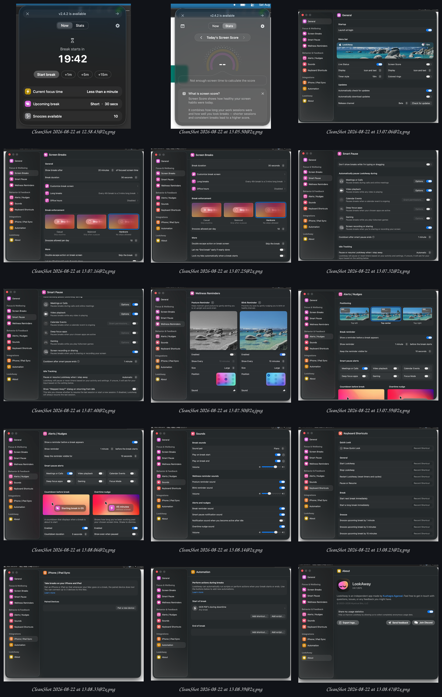

# LookAway Screenshot Audit — 2026-08-22

## Purpose and provenance

This audit records the behavior visible in 15 unique LookAway screenshots supplied by Silouan Wright from his licensed Mac installation. The captures are product references, not Look Elsewhere assets or a mandate to reproduce macOS chrome. Look Elsewhere should transfer useful hierarchy and interaction ideas into Omarchy's own components, theme tokens, typography, bar anchoring, and Wayland behavior.

The originals and a contact sheet are preserved in [`reference-screenshots/lookaway-cleanshot-2026-08-22/`](reference-screenshots/lookaway-cleanshot-2026-08-22/). Before a public release, review whether these third-party reference captures should remain in the public repository. The plugin preview and marketplace media must use original Look Elsewhere captures.

## Transfer rule

Adopt information hierarchy and proven interaction patterns. Adapt them to Omarchy. Do not copy LookAway branding, illustrations, Mac window chrome, settings navigation, or proprietary visual identity.

## Surface inventory

| Capture | Visible behavior | Look Elsewhere decision |
|---|---|---|
| [`01-menu-now.png`](reference-screenshots/lookaway-cleanshot-2026-08-22/01-menu-now.png) | Tall anchored popover; dominant countdown; Start break and +1/+5/+15 actions; three compact status facts | Adopt the countdown hierarchy, economical vertical composition, and bounded +1/+5/+15 snooze choices. Keep Omarchy buttons, policy limits, and bar anchoring. |
| [`02-menu-stats.png`](reference-screenshots/lookaway-cleanshot-2026-08-22/02-menu-stats.png) | Daily screen score, date navigation, score ring and explanation | Defer. A score is gamification and does not improve the core break transition. |
| [`03-general.png`](reference-screenshots/lookaway-cleanshot-2026-08-22/03-general.png) | Login launch, live menu-bar state, icon/text and timer display, updates | Bar display modes already exist. Omarchy owns plugin launch/update lifecycle; do not reproduce it. |
| [`04-screen-breaks-top.png`](reference-screenshots/lookaway-cleanshot-2026-08-22/04-screen-breaks-top.png) | Focus interval, break duration, break-screen customization, long-break cadence, office hours | Core interval/duration/office hours exist. Long-break cadence is a useful P1 extension. |
| [`05-screen-breaks-bottom.png`](reference-screenshots/lookaway-cleanshot-2026-08-22/05-screen-breaks-bottom.png) | Casual/Balanced/Hardcore enforcement, snooze budget, escape behavior, early ending, automatic lock | Adopt Casual/Balanced/Hardcore naming and retain bounded snoozing in Hardcore while making its active break unskippable. Automatic lock remains deferred. |
| [`06-smart-pause-top.png`](reference-screenshots/lookaway-cleanshot-2026-08-22/06-smart-pause-top.png) | Typing/dragging, calls, video, calendar, deep-focus apps | Calls/media/fullscreen already have signal-based detectors. App rules and screen sharing are higher-value gaps than calendar access. |
| [`07-smart-pause-bottom.png`](reference-screenshots/lookaway-cleanshot-2026-08-22/07-smart-pause-bottom.png) | Fullscreen/gaming, recording/sharing, cooldown, away tracking, return dialog | Preserve bounded cooldown and idle accounting. Investigate screen-share detection and a return-from-away decision as P1. |
| [`08-wellness-reminders.jpeg`](reference-screenshots/lookaway-cleanshot-2026-08-22/08-wellness-reminders.jpeg) | Posture and blink reminders with cadence, size, position, sound and preview | A small blink modality fits eye-care scope; posture broadens the product and is P2. Avoid medical claims. |
| [`09-alerts-top.png`](reference-screenshots/lookaway-cleanshot-2026-08-22/09-alerts-top.png) | Top-left/center/right placement; configurable advance warning and visibility | Keep the explicitly chosen top-center warning for the competition cut. The pre-break warning must occur before focus time reaches zero. |
| [`10-alerts-bottom.png`](reference-screenshots/lookaway-cleanshot-2026-08-22/10-alerts-bottom.png) | Final countdown and overtime nudge | Final countdown exists. An overdue/nudge state is a possible P1 improvement if it remains calm. |
| [`11-sounds.png`](reference-screenshots/lookaway-cleanshot-2026-08-22/11-sounds.png) | Sound pairs, start/end toggles, previews and volume | Current optional system cue is sufficient for MVP; richer sound design is P2. |
| [`12-keyboard-shortcuts.png`](reference-screenshots/lookaway-cleanshot-2026-08-22/12-keyboard-shortcuts.png) | Quick look, break control and multiple snooze shortcuts | Document Omarchy/Hyprland IPC keybinding recipes in P1 rather than building a shortcut recorder. |
| [`13-iphone-ipad-sync.png`](reference-screenshots/lookaway-cleanshot-2026-08-22/13-iphone-ipad-sync.png) | Paired mobile devices and synchronized breaks | Explicitly out of the competition scope. |
| [`14-automation.png`](reference-screenshots/lookaway-cleanshot-2026-08-22/14-automation.png) | Start/end break hooks | Promising Omarchy-native power-user feature, but command execution needs a careful trust boundary. P1/P2. |
| [`15-about.png`](reference-screenshots/lookaway-cleanshot-2026-08-22/15-about.png) | Identity, version, usage statistics, logs, feedback/community | Keep identity and diagnostics. Reject telemetry for MVP; consider privacy-safe log export later. |

## Quick-panel design conclusion

The old Look Elsewhere panel allocated roughly 390 theme-space units horizontally to a heading, secondary timer, progress bar, two actions, and one history line. The width added little comprehension. LookAway's menu demonstrates a stronger order:

1. current state;
2. a very large time value;
3. the primary action;
4. secondary actions;
5. compact supporting facts.

Look Elsewhere adopts that order in a narrower, vertically composed anchored panel. It removes the progress bar because the explicit countdown communicates the same information more precisely and with less visual noise. The panel remains attached to the bar icon; only warnings and break surfaces are top-centered/full-screen.

## Configuration conclusion

The screenshots demonstrate considerable configurability, but feature parity would weaken the competition artifact. Omarchy manifest settings and text configuration remain the authoritative MVP configuration surface. A dedicated QML settings prototype stays archived for a later phase. New settings should be added only when a shipped behavior cannot have a safe, clear default.

## Follow-up design detail

LookAway uses a rolling/ticker treatment when countdown values change. Explore an Omarchy-native version for both the anchored-panel countdown and the full-screen break countdown after the panel structure and documentation are settled. It must preserve stable geometry, reduced-motion behavior, and screen-reader clarity.
